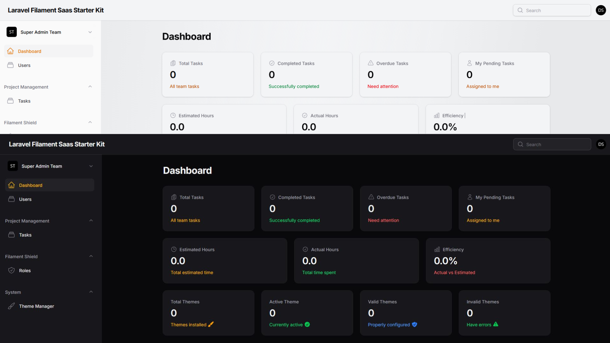

<p align="center">
  
</p>
<h1 align="center">🚀 Laravel Filament SaaS Starter Kit</h1>

<p align="center">
  A powerful and extendable multi-tenant SaaS starter built with <strong>Laravel 12</strong> and <strong>Filament</strong> 4.x.
</p>

<p align="center">
  
  
  
  
</p>

---

## ⚠️ License and Usage

This project is licensed under the **GNU Affero General Public License v3.0 (AGPL-3.0)** with additional commercial use restrictions.

### This Means

✅ **CAN:**
- Use this software for **personal/non-commercial projects**
- Study the code and learn from it
- Modify and extend it for your own use
- Contribute improvements back to the project

❌ **CANNOT:**
- Use this software for **commercial purposes** without written permission
- Use it for client projects without licensing
- Resell or rebrand it as your own product
- Use it in any commercial SaaS offering without permission

### 🔒 Commercial Licensing

If you want to use this software commercially, please contact the author for a commercial license. This ensures:
- Proper attribution and support
- Legal protection for both parties
- Fair compensation for the original work

### 📝 Attribution Requirements

If you use this software (even non-commercially), you must:
1. Include the original copyright notice
2. Link back to this repository
3. Keep the LICENSE file intact
4. Disclose any modifications you make

**Unauthorized commercial use will be considered a copyright violation and may result in legal action.**

For licensing inquiries: [aqibullah3312@gmail.com]

## 🧩 Overview

This project is a **tenant-based SaaS web application** built using Laravel and Filament. It's designed to help you kickstart your own Software as a Service platform with built-in team support, roles, permissions, charts, task management, and more.

Ideal for developers looking for a **clean, extensible foundation** with multi-tenancy already configured out of the box.

---

## ✨ Features

- 🔐 **Authentication System**
  - Login, Register, Forgot Password
  - Email verification support
  - Invite-based user onboarding (future)
  
- 👥 **Multi-Tenant Architecture**
  - Team-based tenancy using Filament multi-tenancy
  - Users can belong to multiple teams
  - Switch between teams easily
  
- ✅ **Task Management**
  - Create, update, assign tasks
  - Track task status: Pending, In Progress, Completed
  - Due dates, priority levels

- 📊 **Dashboards & Analytics**
  - Charts and graphs to analyze tasks
  - Team stats overview
  - Progress tracking

- 🔐 **Roles & Permissions**
  - Powered by Spatie Laravel Permission (team-aware)
  - Admin, Super Admin, User, and custom roles
  - Fine-grained access control per team

- 🧰 **Developer-Friendly**
  - Uses Laravel's latest features (v12+)
  - Built with Filament (v4+) — fast, beautiful admin UI
  - Easily extendable with custom widgets, panels, and resources

- 🌐 **Future-Proof**
  - Ready for modular plugins like billing, notifications, team invites, chat
  - Roadmap planned for many more features (see below)

---


## 🛠 Tech Stack

- **Laravel** 12+
- **Filament** 4.x (Admin UI)
- **Spatie Laravel Permission** (Roles & Permissions)
- **Filament Shield** (Permission generator)
- **Livewire** (Dynamic components)
- **Tailwind CSS** (Frontend)
- **MySQL / PostgreSQL** (DB)

---

## 🚀 Getting Started

### 📦 Prerequisites

- PHP 8.2+
- Composer
- Node.js & npm
- MySQL or PostgreSQL

### 🧾 Installation


```bash
# Clone the repo
git clone https://github.com/AqibUllah/Laravel-Filament-Starter-Kit

cd laravel-filament-saas-kit

# Install dependencies
composer install
npm install && npm run build

# Copy and configure environment
cp .env.example .env
php artisan key:generate

# Set up your DB credentials in .env
# Then run migrations and seeders
php artisan migrate:fresh
php artisan shield:generate --panel=tenant --option=permissions --all
php artisan db:seed

# Start local development server
php artisan serve

# admin panel
Email: superadmin@example.com
Password: password

# tenant panel
Email: teamadmin@example.com
Password: password
